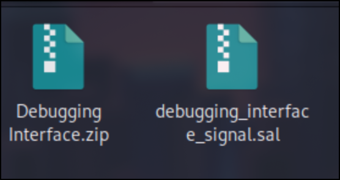

# Preliminary Steps

First, to begin with the basic challenge description and downloads. After which comes the analysis of the files themselves. What came in the .zip is simply a .sal file which is readable via a program called Logic.

